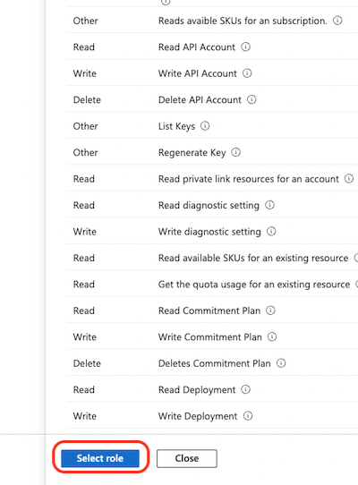
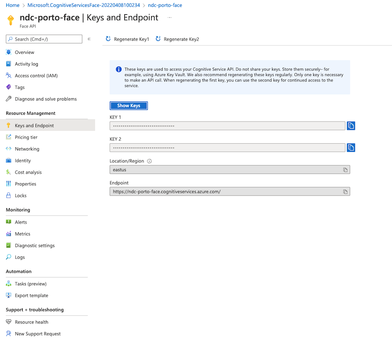
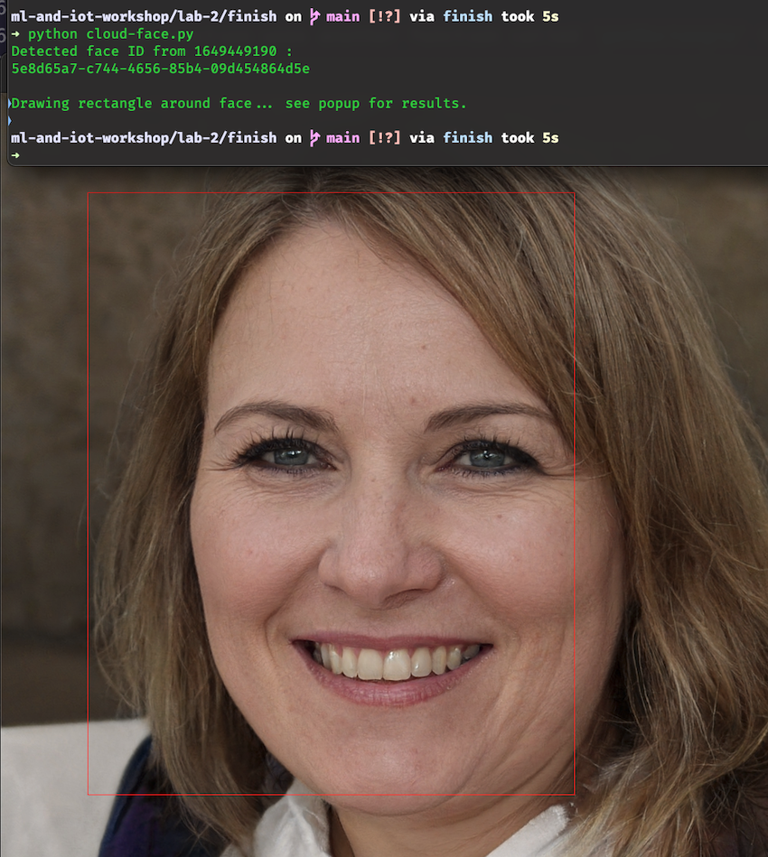

# Lab 2 - Using Cloud Services for ML

In this lab, you'll learn how cloud service providers work.

## Prerequisites

- [Azure Subscription](https://azure.microsoft.com/en-us/free/cognitive-services/)
- [Python 3.x](https://www.python.org/)
- [Python pip](https://pip.pypa.io/en/stable/)

## Add a Cognitive Services Contributor Role

In order to use Azure cognitive services, you'll need to agree to Microsoft's responsible AI terms. Once you've signed into your Azure account, you can follow the steps below and consult the document [here](https://docs.microsoft.com/en-us/azure/role-based-access-control/role-assignments-portal?tabs=current) for more information.

1. Navigate to your Subscription or Azure account and click the "Access control (IAM)" menu item. Then, click "Add role assignment."


2. In the role assignment search box, type "Cognitive" and click the "View" link for "Cognitive Services Contributor."


3. Click "Select role" at the bottom of the slide-out window.



4. Under "Members," select your account.


5. Click the "Review + assign" button at the bottom of the screen.


## Create an Azure Face Resource

1. Create a Face resource using [this link](https://portal.azure.com/#create/Microsoft.CognitiveServicesFace). Select your subscription and select or create a resource group. Select a region, give the service a name, and choose the free pricing tier. Finally, click "Review + create" then "Create" on the summary screen to create the service.


2. Once Deployment is complete, click "Go to resource."


3. Click the "Keys and endpoint" menu item and take note of your keys and endpoint. You'll need these for the next step.



## Use the Face Service

Now let's create a Python module to use the Face service to detect faces in a picture.

1. Open a terminal on your computer and navigate to the `start` folder in this directory.
2. Create a Python [Virtual environment](https://pypi.org/project/virtualenv/) using the following commands. This step is not required, but useful as it will ensure that all of the tools you need for this lab are installed cleanly and in a local directory.

On Linux, macOS, or WSL on Windows, run:

```bash
python3 -m venv env
source env/bin/activate
```

For Windows Powershell, run the following as an admin:

```ps1
python -m venv env
.\env\Scripts\Activate.ps1
```


3. Install the Azure Cognitive Services Vision SDK and the Python image library Pillow

```bash
pip install --upgrade azure-cognitiveservices-vision-face
pip install Pillow
```

4. Crete a new Python file named config.py and add your Service endpoint and key.

```python
KEY = "PASTE_YOUR_FACE_SUBSCRIPTION_KEY_HERE"

ENDPOINT = "PASTE_YOUR_FACE_ENDPOINT_HERE"
```

5. Create a new file called `cloud-face.py` and add the following imports:

```python
import asyncio
import io
import glob
import os
import sys
import time
import uuid
import requests
from urllib.parse import urlparse
from io import BytesIO
from PIL import Image, ImageDraw, ImageFont
from azure.cognitiveservices.vision.face import FaceClient
from msrest.authentication import CognitiveServicesCredentials
from azure.cognitiveservices.vision.face.models import TrainingStatusType, Person, QualityForRecognition
```

6. Add an import for your `config.py` file so you can retrieve the endpoint and key.

```python
import config
```

7. Add local variables to hold the key and endpoint.

```python
subscription_key = config.KEY
assert subscription_key

face_api_url = config.ENDPOINT
assert face_api_url

```

8. Create a Face service client object and authenticate using your key.

```python
face_client = FaceClient(face_api_url, CognitiveServicesCredentials(subscription_key))
```

9. Now, let's perform a simple test using a random face from [fakeface.rest](https://hankhank10.github.io/fakeface/). Add the following, just after the `face_client` initialization line:

```python
stamp = round((time.time()))
# Detect a face in a random image that contains a single face
single_face_image_url = 'https://fakeface.rest/face/view'
single_image_name = str(stamp)

# We use detection model 3 to get better performance.
detected_faces = face_client.face.detect_with_url(url=single_face_image_url, detection_model='detection_03')
if not detected_faces:
    raise Exception('No face detected from image {}'.format(single_image_name))

# Display the detected face ID in the first single-face image.
# Face IDs are used for comparison to faces (their IDs) detected in other images.
print('Detected face ID from', single_image_name, ':')
for face in detected_faces: print (face.face_id)
print()
```

10. Next, run the module from the terminal with the command `python cloud-face.py` and you'll see something like the following:

```bash
Detected face ID from 1649448566 :
bab15626-b5f4-46d3-a356-44aafc2e9862
```

Not very interesting, so let's use the Face API to draw a bounding box around the original image and open the image on your local machine.

11. Start by adding a function to download the image, and using coordinates from the Azure Face API, draw a bounding box using the Pillow library, and save the image to a local directory.

```python
def drawFaceRectangles() :
    response = requests.get(single_face_image_url)
    img = Image.open(BytesIO(response.content))

    # For each face returned use the face rectangle and draw a red box.
    print('Drawing rectangle around face... see popup for results.')
    draw = ImageDraw.Draw(img)
    for face in detected_faces:
        draw.rectangle(getRectangle(face), outline='red')

    img.show()
    img.save(os.getcwd() + "/test-images/" + single_image_name + "_modified.png", "PNG")
```

12. This function uses another function called `getRectangle` that we also need to add.

```python
def getRectangle(faceDictionary):
    rect = faceDictionary.face_rectangle
    left = rect.left
    top = rect.top
    right = left + rect.width
    bottom = top + rect.height

    return ((left, top), (right, bottom))
```

This function takes the raw Face object from Azure and extracts the rectangle coordinates into a tuple for Pillow to use when drawing the rectangle onto the image.

```json
{'additional_properties': {}, 'width': 559, 'height': 775, 'left': 225, 'top': 162}
```

13. Now, add a call to `drawFaceRectangles()` at the bottom of your `cloud-face.py` and re-run it using `python cloud-face.py`. Once complete, the image will open.



## Add Emotion Detection

Finally, let's add emotion detection to our script and write that on the image, as well.

1. Start by adding an `attrs` variable to your script, just before then call to `detect_with_url`

```python
attrs = ["age", "gender", "headPose", "smile", "facialHair", "glasses", "emotion", "hair", "makeup", "occlusion", "accessories", "blur", "exposure", "noise"]
```

2. Then, modify `detect_with_url` to pass in the attributes string as a parameter and change the `detection_model`:

```python
detected_faces = face_client.face.detect_with_url(url=single_face_image_url,
                                                  detection_model='detection_01',
                                                  return_face_attributes=attrs)
```

If you want to see the results of this change on an image before proceeding, you can add a `print(face.face_attributes)` to the `for-in` loop and you'll see something like this:

```json
{'additional_properties': {}, 'age': 24.0, 'gender': <Gender.female: 'female'>, 'smile': 1.0, 'facial_hair': <azure.cognitiveservices.vision.face.models._models_py3.FacialHair object at 0x10fb08160>, 'glasses': <GlassesType.no_glasses: 'noGlasses'>, 'head_pose': <azure.cognitiveservices.vision.face.models._models_py3.HeadPose object at 0x10fb086d0>, 'emotion': <azure.cognitiveservices.vision.face.models._models_py3.Emotion object at 0x10fb087f0>, 'hair': <azure.cognitiveservices.vision.face.models._models_py3.Hair object at 0x10fb08a30>, 'makeup': <azure.cognitiveservices.vision.face.models._models_py3.Makeup object at 0x10fb08af0>, 'occlusion': <azure.cognitiveservices.vision.face.models._models_py3.Occlusion object at 0x10fb08b50>, 'accessories': [], 'blur': <azure.cognitiveservices.vision.face.models._models_py3.Blur object at 0x10fb08790>, 'exposure': <azure.cognitiveservices.vision.face.models._models_py3.Exposure object at 0x10fb08820>, 'noise': <azure.cognitiveservices.vision.face.models._models_py3.Noise object at 0x10fb08be0>, 'mask': None, 'quality_for_recognition': None}
```

You can also view the `Emotion` object with `print(face.face_attributes.emotion)` and you'll see an object that returns the probability (0 to 1) that the face is conveying each of a pre-set number of emotions. The sum of all probabilities will be 1, so the number closest to one represents the emotion that the model is most confident in.

```json
{'additional_properties': {}, 'anger': 0.0, 'contempt': 0.0, 'disgust': 0.0, 'fear': 0.0, 'happiness': 1.0, 'neutral': 0.0, 'sadness': 0.0, 'surprise': 0.0}
```

3. Let's use the emotion object to write the predominant emotion on the image. Start by creating a function to take the face object, extract the emotion object and sort the results.

```python
def getMainEmotion(faceDictionary):
    # Get the emotion collection and sort in ascending order to get the top result
    emotions = faceDictionary.face_attributes.emotion
    emotionList = {
                    "anger": emotions.anger,
                    "contempt": emotions.contempt,
                    "disgust": emotions.disgust,
                    "fear": emotions.fear,
                    "happiness": emotions.happiness,
                    "neutral": emotions.neutral,
                    "sadness": emotions.sadness,
                    "surprise": emotions.surprise
                }

    emotionList = sorted(emotionList.items(), key=lambda item: item[1], reverse=True)

    print('Predominant emotion is ' + str(emotionList[0]))
    return emotionList[0]
```

4. Next, add another function to determine the right location relative to the face rectangle to write the text.

```python
def getCoordsForText(faceDictionary):
    rect = faceDictionary.face_rectangle
    left = rect.left
    top = rect.top
    return (left, top - 50)
```

5. Modify the `drawFaceRectangles` function to load a local font to use for writing text. Add the following just after the call to `Image.open()`

```python
fnt = ImageFont.truetype('../assets/Roboto-Regular.ttf', 50)
```

6. After `draw.rectangle`, add a call to `draw.text`

```python
draw.text(getCoordsForText(face), str(getMainEmotion(face)), fill=(255, 255, 255, 255), font=fnt)
```

7. Run `python cloud-face.py` and you should see text on the image with the emotion prediction.


## Next Steps

If you want to keep playing with this example, why not try:

- Using `detect_with_stream` instead of `detect_with_url` to load a file with multiple faces (like [this one](assets/Dagestani_man_and_woman.jpg)) and create multiple bounding boxes.
- Capture an image from your phone or webcam and run it though the service.
- Try other example from the [Service Quickstart](https://docs.microsoft.com/en-us/azure/cognitive-services/Face/Quickstarts/client-libraries?pivots=programming-language-python&tabs=visual-studio)